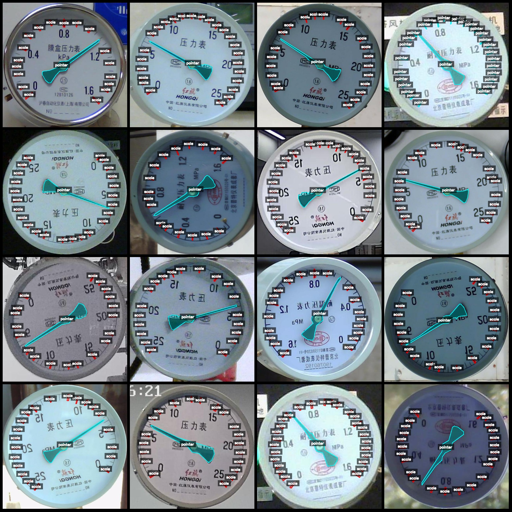
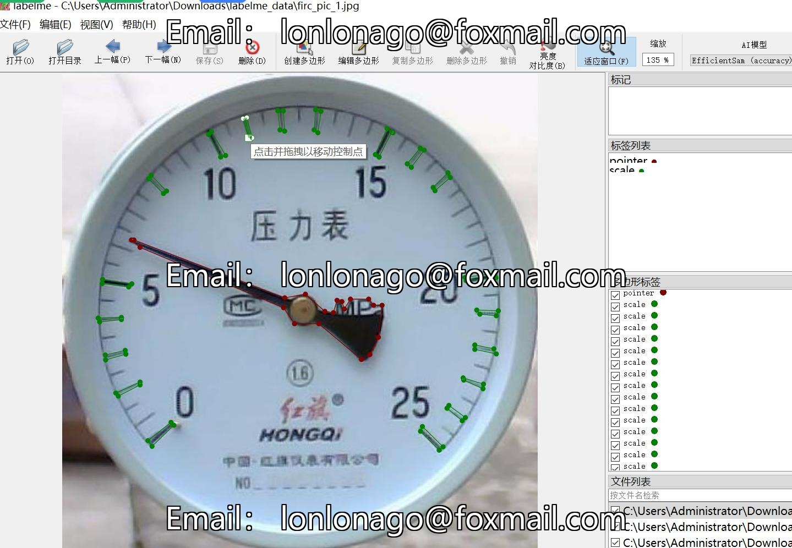

# Dashboard scale and pointer recognition segmentation dataset in labelme format, 191 images with 2 categories

Dataset format: LabelMe format (excluding mask files, only containing jpg images and corresponding json files)  
Number of images (number of jpg files): 191  
Number of annotations (json file count): 191  
Number of annotation categories: 2  
Annotation category names: ["pointer", "scale"]  
Number of boxes for each category:  
- Pointer count = 278  
- Scale count = 3770  
Total boxes: 4048  
Annotation tool used: labelme=5.5.0  
Image resolution: 640x640  
Annotation rules: Polygons are drawn around categories  
Important note: The dataset can be opened and edited using the labelMe tool, but the json dataset needs to be converted into either a mask or Yolo/COCO format for semantic segmentation or instance segmentation.  
Special declaration: This dataset does not guarantee the accuracy of the trained models or weight files.  
Image preview:  
Annotation examples:  
Randomly selected 16 images to demonstrate:  
Annotation drawing results:  
LabelMe editing image example:

## Images

Here is a pay link on Stripe ( https://buy.stripe.com/3cs8yP7sY87d0vu9AB ). Please contact me lonlonago@foxmail.com after funding $89, and I will send you a complete data files , thank you!

